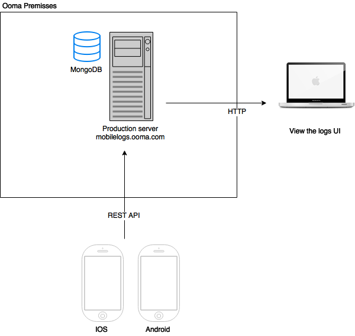

#Mobile Logs Server
August 13, 2015

Mobile logs server collect and save Ooma Mobile app logs.


We have one dev server and one production server located at Ooma's HQ.

- Dev server: http-log.corp.ooma.com
- Production server: mobilelogs.ooma.com

To access the website UI you need to signup and use invitation code !ooma1234@. This invitation code should be keep remain secret as other people might signup to this service.




##Mobile Device Use case Diagram


##Users Device Use case Diagram


##API

###[Create Session (/api/v1/session)](id:createsession)
####Description:
Create temporary session, output key is used to validate request input body.

####input
Format - Short names from web requests(compressed format) – full name (Data Format): Description
- "f" - apikey (String) : apikey
- "w" – access token (String): Web API access Token
- "h" - devid (String) : Device id
- "j" - Os_name (String) : For example: IOS, ANDROID, WP, BLACKBERRY
- "i" - hw_info (String) : For Example [iPhone 5s, iPhone 5c, iPhone 6, Nexus 6, galaxy 6]
- "o" - osVersion (String): Device operating system version for example: 8.3, 5.2
- "a" - AppVersion(String): application version
- "m" - appName(String): application name (mobile/office)
- "q" – devManufacturer(String): Device manufacturer (Apple, Samsung etc.)

####output:
  - sessionid (String) : Used when upload log or event
 
####method: 
- POST
	
	


###[Save log (/api/v1/log)](id:savelog)
####Description:
Upload log to mobilelog server

####input:
Format - Short names from web requests(compressed format) – full name (Data Format): Description
- "f" - apikey (String) : apikey
- "w" – access token (String): Web API access Token
- "s" - sessionid (String) : Session id from create session
- "h" - devid (String) : Device id
- "a" - app_version:  application version             
- "o" - os_version: Operation system version             
- "m" - app_name:  Application name     
- "q" – devManufacturer(String): Device manufacturer (Apple, Samsung etc.)
- "i" - hw_info:  Hardware model
- "j" - os_name: Operation system name (Android,iOS)
- "p"- phone_number: String
- "x"- phone_ext: String,
- "d" - data (log objects) : Array of of log objects


log objects:
		
```
		[{
            "v" - level: int,
            "l" - log: String,
            "y" - processid: String,
            "g" - tag: String,
            "gl" – geolocation : Object,    --(ex {type:"point", "coordinates": [ -73.97, 40.77 ] }
            "mo" – motion : String
            "b"-  db_id: String,
            "r"- local_ip: String, //Local ip address of device
            "c" - client_date: date //Local date of device when log was generated

		}];
```			

####methods: 
- POST


###[Save event (/api/v1/event)](id:saveevent)
####Description:
Upload events to mobilelog server

####input:
Format - Short names from web requests(compressed format) – full name (Data Format): Description
- "f" - apikey (String) : apikey
- "w" – access token (String): Web API access Token
- "s" - sessionid (String) : Session id from create session
- "h" - devid (String) : Device id
- "a" - app_version:  application version             
- "o" - os_version: Operation system version             
- "m" - app_name:  Application name   
- "q" – devManufacturer(String): Device manufacturer (Apple, Samsung etc.)
- "i" - hw_info:  Hardware model
- "j" - os_name: Operation system name (Android,iOS)
- "p" - phone_number: String
- "x" - phone_ext: String
- "d" - data (event objects) : Array of of event objects


event objects:
		
```
		[{
		   "t" - event_type and event_name: String,  (both values in one number, description below)       
           "e" - event_data: Event data object(array),
           "g" - tag: String,
           "gl" - geolocation : Object,    --(ex {type:"point", "coordinates": [ -73.97, 40.77 ] }
           "mo" - motion : String
	       "b" - db_id: String //row id from app local Database
           "r" - local_ip: String, //Local ip address of device
           "c" - client_date: date //Local date of device event was generated

		}];
```			

event data object:


```
	[{ 
        "z" - label: String,
        "k" - value: String

	},
	{ 
        "z" - label: String,
        "k" - value: String

	}]
```


####methods: 
- POST


